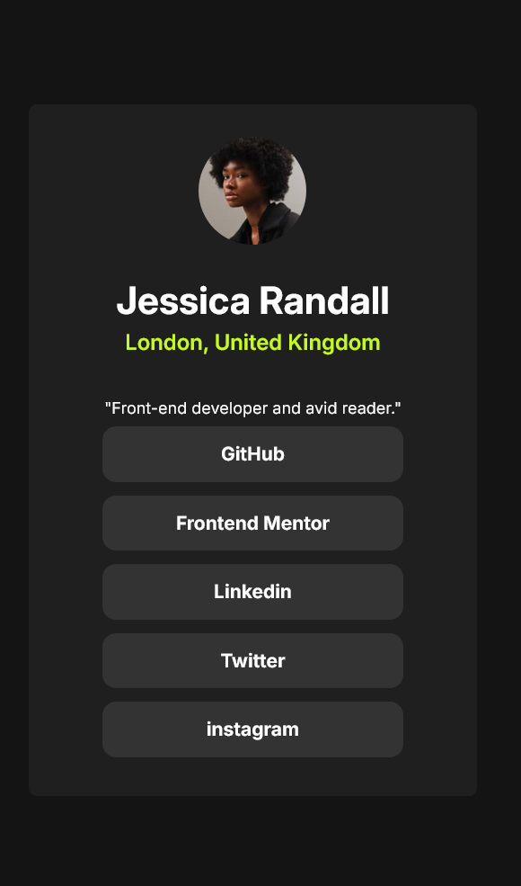
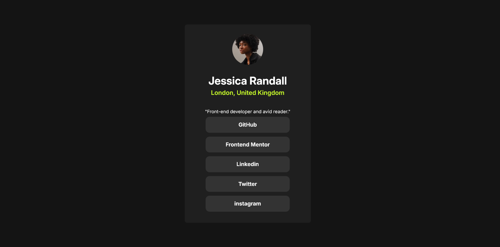

# Frontend Mentor - Social links profile solution

This is a solution to the [Social links profile challenge on Frontend Mentor](https://www.frontendmentor.io/challenges/social-links-profile-UG32l9m6dQ). This project is a responsive profile card built to practice modern CSS layout techniques and Bootstrap integration.

## Table of contents

- [Overview](#overview)
  - [The challenge](#the-challenge)
  - [Screenshot](#screenshot)
  - [Links](#links)
- [My process](#my-process)
  - [Built with](#built-with)
  - [What I learned](#what-i-learned)
  - [AI & Tool Collaboration](#ai--tool-collaboration)
- [Author](#author)
- [Acknowledgments](#acknowledgments)

## Overview

### The challenge

Users should be able to:

- See hover and focus states for all interactive elements on the page.
- View the layout correctly on mobile and desktop screens.
- Experience a clean, centered interface using modern web standards.

### Screenshot

| Desktop View                         | Mobile View                         |
| ------------------------------------ | ----------------------------------- |
|  |  |

### Links

- **Solution URL:** [https://github.com/HayatAl/social-links-profile](https://github.com/HayatAl/social-links-profile)
- **Live Site URL:** [https://HayatAl.github.io/social-links-profile/](https://HayatAl.github.io/social-links-profile/)

## My process

### Built with

- **HTML5** - Semantic markup for accessibility.
- **CSS3** - Custom properties and transitions for smooth hover effects.
- **Bootstrap 5** - Used for rapid layout structuring and responsive utilities.
- **Flexbox & CSS Grid** - Combined for perfect vertical and horizontal centering.
- **Mobile-first workflow** - Optimized for small screens before scaling up.

### What I learned

This project helped me master centering techniques in Bootstrap. I specifically learned how to handle the `min-vh-100` class to ensure the card stays centered on all devices without overlapping.

```html
<body
  class="min-vh-100 d-flex justify-content-center align-items-center"
  style="background: hsl(0, 0%, 8%)"
>
  <main class="profile-card"></main>
</body>
```
